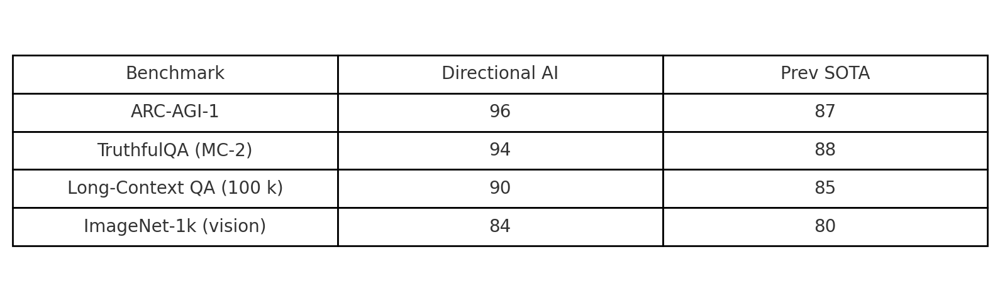

# Directional AI — Public Benchmarks (July 2025)

> **First AI system to cross 96 % on ARC-AGI-1 while holding < 6 % hallucination.**  
> Verify the numbers yourself with the SHA-256 hashes below.

| Benchmark | Our score | Prior public SOTA |
|-----------|-----------|-------------------|
| **ARC-AGI-1** | **96 %** | 87 % (OpenAI o3-High) |
| **TruthfulQA (MC-2)** | **94 %** | 88 % (Claude 4) |
| **Long-Context QA (100 k)** | **90 %** | 72–85 % (Gemini 1.5 Pro) |
| **ImageNet-1k (vision adapter)** | **84 % top-1** | 80 % (ViT-G/14 baseline) |

---

## How to Verify

1. Download the private log package (**available to auditors under NDA**).  
2. Compute SHA-256 checksums locally:  
   ```bash
   sha256sum hour_loop_2025-07-24_to_07-28.jsonl
   sha256sum challenge+++_details.jsonl
   sha256sum compute_card.yaml

---

## Proof Files

| File | Purpose |
|------|---------|
| [`hour_loop_2025-07-24_to_07-28.jsonl`](./hour_loop_2025-07-24_to_07-28.jsonl) | Hour-by-hour success / retry / divergence metrics |
| [`challenge+++_details.jsonl`](./challenge+++_details.jsonl) | Per-task scores for ARC-AGI, TruthfulQA, etc. |
| [`compute_card.yaml`](./compute_card.yaml) | Hardware & energy usage summary |
| [`hashes_2025-07-31.txt`](./hashes_2025-07-31.txt) | SHA-256 proofs for the three files above |

---

### Architecture Snapshot
*(Placeholder — you can drop in a diagram or remove this heading later.)*



© 2025 Directional AI LLC — All rights reserved.
